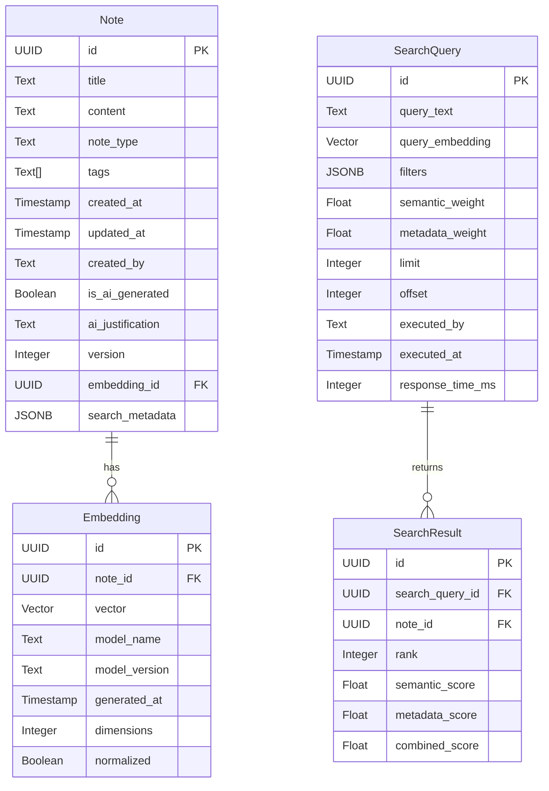

# Data Model: Semantic Search Pipeline

**Feature**: Semantic Search Pipeline  
**Branch**: `001-semantic-search`  
**Date**: 2025-11-28  
**Plan**: [plan.md](plan.md)  
**Research**: [research.md](research.md)

## Entity Overview

The semantic search pipeline extends the existing BrainForge data model with search-specific entities and relationships:

### Core Entities

1. **Note** (Existing - Enhanced)
2. **Embedding** (New - Search-specific)
3. **SearchQuery** (New - Audit trail)
4. **SearchResult** (New - Result tracking)

## Entity Definitions

### Note Entity (Enhanced)

**Purpose**: Core knowledge unit with search metadata

**Fields**:
- `id` (UUID) - Primary identifier
- `title` (Text) - Note title for display and search
- `content` (Text) - Note content for semantic search
- `note_type` (Enum) - Type classification (fleeting, literature, permanent, insight, agent-generated)
- `tags` (Array[Text]) - Categorization tags for metadata filtering
- `created_at` (Timestamp) - Creation timestamp
- `updated_at` (Timestamp) - Last modification timestamp
- `created_by` (Text) - User/agent identifier for provenance
- `is_ai_generated` (Boolean) - AI content flag for constitutional compliance
- `ai_justification` (Text) - AI reasoning for constitutional compliance
- `version` (Integer) - Version number for auditability

**Search-Specific Enhancements**:
- `embedding_id` (UUID) - Foreign key to Embedding entity
- `search_metadata` (JSONB) - Search optimization metadata (word count, language, etc.)

### Embedding Entity (New)

**Purpose**: Vector representations for semantic search

**Fields**:
- `id` (UUID) - Primary identifier
- `note_id` (UUID) - Foreign key to Note
- `vector` (Vector[1536]) - Embedding vector (OpenAI text-embedding-3-small dimensions)
- `model_name` (Text) - Embedding model identifier ("openai-text-embedding-3-small")
- `model_version` (Text) - Model version for tracking
- `generated_at` (Timestamp) - Embedding generation timestamp
- `dimensions` (Integer) - Vector dimensions (1536)
- `normalized` (Boolean) - Whether vector is normalized

**Indexes**:
- Primary index on `id`
- Foreign key index on `note_id`
- HNSW index on `vector` for semantic search

### SearchQuery Entity (New)

**Purpose**: Audit trail for search operations (constitutional requirement)

**Fields**:
- `id` (UUID) - Primary identifier
- `query_text` (Text) - Original search query text
- `query_embedding` (Vector[1536]) - Embedded query vector
- `filters` (JSONB) - Applied metadata filters
- `semantic_weight` (Float) - Semantic search weight (0.0-1.0)
- `metadata_weight` (Float) - Metadata search weight (0.0-1.0)
- `limit` (Integer) - Result limit
- `offset` (Integer) - Pagination offset
- `executed_by` (Text) - User/agent identifier
- `executed_at` (Timestamp) - Query execution timestamp
- `response_time_ms` (Integer) - Query performance metric

### SearchResult Entity (New)

**Purpose**: Individual result tracking for search auditability

**Fields**:
- `id` (UUID) - Primary identifier
- `search_query_id` (UUID) - Foreign key to SearchQuery
- `note_id` (UUID) - Foreign key to Note
- `rank` (Integer) - Result position (1-based)
- `semantic_score` (Float) - Semantic similarity score (0.0-1.0)
- `metadata_score` (Float) - Metadata relevance score (0.0-1.0)
- `combined_score` (Float) - Final hybrid score (0.0-1.0)

## Relationships



## Database Schema

### Notes Table (Enhanced)

```sql
CREATE TABLE notes (
    id UUID PRIMARY KEY DEFAULT gen_random_uuid(),
    title TEXT NOT NULL,
    content TEXT NOT NULL,
    note_type TEXT NOT NULL CHECK (note_type IN ('fleeting', 'literature', 'permanent', 'insight', 'agent-generated')),
    tags TEXT[] DEFAULT '{}',
    created_at TIMESTAMP WITH TIME ZONE DEFAULT NOW(),
    updated_at TIMESTAMP WITH TIME ZONE DEFAULT NOW(),
    created_by TEXT NOT NULL,
    is_ai_generated BOOLEAN DEFAULT FALSE,
    ai_justification TEXT,
    version INTEGER DEFAULT 1 CHECK (version >= 1),
    embedding_id UUID REFERENCES embeddings(id),
    search_metadata JSONB DEFAULT '{}',
    
    -- Indexes for search performance
    CONSTRAINT valid_weights CHECK (semantic_weight + metadata_weight = 1.0)
);

-- Search optimization indexes
CREATE INDEX idx_notes_note_type ON notes(note_type);
CREATE INDEX idx_notes_tags ON notes USING GIN(tags);
CREATE INDEX idx_notes_created_at ON notes(created_at);
CREATE INDEX idx_notes_updated_at ON notes(updated_at);
```

### Embeddings Table

```sql
CREATE TABLE embeddings (
    id UUID PRIMARY KEY DEFAULT gen_random_uuid(),
    note_id UUID NOT NULL REFERENCES notes(id) ON DELETE CASCADE,
    vector VECTOR(1536) NOT NULL,
    model_name TEXT NOT NULL,
    model_version TEXT NOT NULL,
    generated_at TIMESTAMP WITH TIME ZONE DEFAULT NOW(),
    dimensions INTEGER DEFAULT 1536 CHECK (dimensions = 1536),
    normalized BOOLEAN DEFAULT TRUE,
    
    -- Ensure one embedding per note
    UNIQUE(note_id),
    
    -- Semantic search index
    CREATE INDEX idx_embeddings_vector ON embeddings USING hnsw (vector vector_l2_ops) 
    WITH (m = 16, ef_construction = 64, ef_search = 40);
);
```

### Search Queries Table

```sql
CREATE TABLE search_queries (
    id UUID PRIMARY KEY DEFAULT gen_random_uuid(),
    query_text TEXT NOT NULL,
    query_embedding VECTOR(1536),
    filters JSONB DEFAULT '{}',
    semantic_weight FLOAT NOT NULL CHECK (semantic_weight >= 0.0 AND semantic_weight <= 1.0),
    metadata_weight FLOAT NOT NULL CHECK (metadata_weight >= 0.0 AND metadata_weight <= 1.0),
    limit INTEGER DEFAULT 10 CHECK (limit > 0 AND limit <= 100),
    offset INTEGER DEFAULT 0 CHECK (offset >= 0),
    executed_by TEXT NOT NULL,
    executed_at TIMESTAMP WITH TIME ZONE DEFAULT NOW(),
    response_time_ms INTEGER CHECK (response_time_ms >= 0),
    
    -- Weight validation
    CONSTRAINT valid_weights CHECK (semantic_weight + metadata_weight = 1.0)
);

CREATE INDEX idx_search_queries_executed_at ON search_queries(executed_at);
CREATE INDEX idx_search_queries_executed_by ON search_queries(executed_by);
```

### Search Results Table

```sql
CREATE TABLE search_results (
    id UUID PRIMARY KEY DEFAULT gen_random_uuid(),
    search_query_id UUID NOT NULL REFERENCES search_queries(id) ON DELETE CASCADE,
    note_id UUID NOT NULL REFERENCES notes(id) ON DELETE CASCADE,
    rank INTEGER NOT NULL CHECK (rank >= 1),
    semantic_score FLOAT NOT NULL CHECK (semantic_score >= 0.0 AND semantic_score <= 1.0),
    metadata_score FLOAT NOT NULL CHECK (metadata_score >= 0.0 AND metadata_score <= 1.0),
    combined_score FLOAT NOT NULL CHECK (combined_score >= 0.0 AND combined_score <= 1.0),
    
    -- Ensure unique ranking per query
    UNIQUE(search_query_id, rank)
);

CREATE INDEX idx_search_results_query ON search_results(search_query_id);
CREATE INDEX idx_search_results_note ON search_results(note_id);
```

## Validation Rules

### Constitutional Compliance

1. **Provenance Tracking**: All search operations include `executed_by` and timestamp
2. **Version Control**: Note versions tracked for auditability
3. **AI Content Identification**: AI-generated content clearly marked with justification
4. **Performance Monitoring**: Response times tracked for constitutional performance requirements
5. **Error Handling**: Comprehensive logging and error recovery mechanisms

### Data Integrity

1. **Embedding Consistency**: One embedding per note with model version tracking
2. **Search Auditability**: Complete audit trail for all search operations
3. **Score Validation**: All scores normalized between 0.0 and 1.0
4. **Weight Validation**: Search weights sum to 1.0 for consistent ranking

## Migration Strategy

### Phase 1: Schema Creation
- Create new tables (embeddings, search_queries, search_results)
- Add embedding_id foreign key to notes table
- Create HNSW index on embeddings.vector

### Phase 2: Data Migration
- Generate embeddings for existing notes
- Update notes with embedding references
- Validate search functionality

### Phase 3: Performance Optimization
- Tune HNSW index parameters
- Implement caching strategies
- Establish performance benchmarks

This data model supports constitutional requirements while enabling efficient semantic search with comprehensive audit trails.