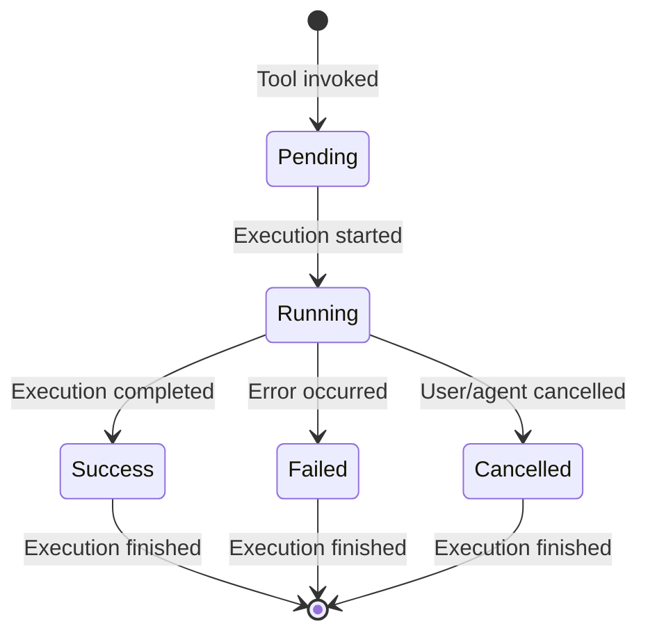
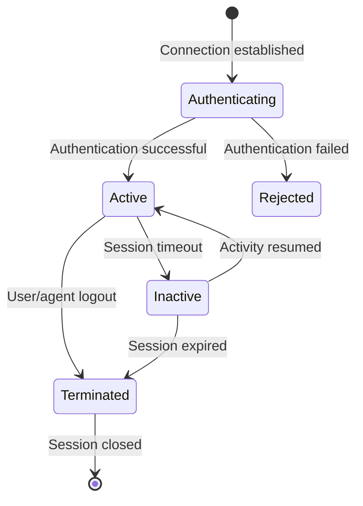
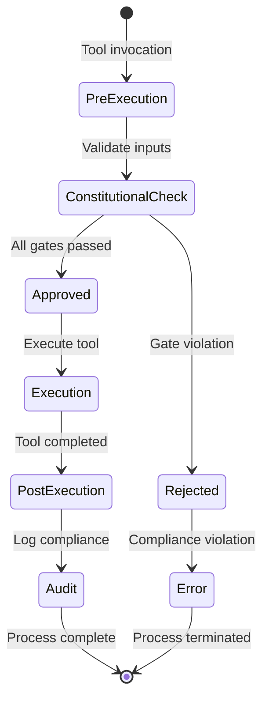

# Data Model: FastMCP Library Interface

**Feature**: FastMCP Library Interface (specs/004-library-mcp/spec.md)  
**Date**: 2025-11-29  
**Status**: Phase 1 Design Complete

## Entity Definitions

### MCP Tool Definition Entity

**Table**: `mcp_tools`

| Field | Type | Constraints | Description |
|-------|------|-------------|-------------|
| id | UUID | Primary Key | Unique tool identifier |
| name | String(255) | Unique, Not Null, Indexed | Tool name (e.g., "semantic_search") |
| description | Text | Not Null | Tool description for documentation |
| input_schema | JSONB | Not Null | JSON Schema for tool inputs |
| output_schema | JSONB | Not Null | JSON Schema for tool outputs |
| tags | String[] | Default: [] | Tool categorization tags |
| is_active | Boolean | Default: True | Tool activation status |
| requires_auth | Boolean | Default: True | Whether tool requires authentication |
| constitutional_gates | String[] | Default: [] | Constitutional gates to enforce |
| created_at | DateTime | Default: now() | Tool creation timestamp |
| updated_at | DateTime | Default: now() | Last update timestamp |

**Relationships**:
- One-to-many with MCP tool executions (audit trail)
- Many-to-many with MCP server instances

**Validation Rules**:
- Name: 3-50 characters, alphanumeric and underscores only
- Input/output schema: Valid JSON Schema format
- Tags: Maximum 10 tags per tool
- Constitutional gates: Must reference valid constitutional principles

### MCP Tool Execution Entity

**Table**: `mcp_tool_executions`

| Field | Type | Constraints | Description |
|-------|------|-------------|-------------|
| id | UUID | Primary Key | Unique execution identifier |
| tool_id | UUID | Foreign Key, Not Null | Reference to MCP tool |
| session_id | UUID | Not Null, Indexed | MCP session identifier |
| input_parameters | JSONB | Not Null | Tool input parameters |
| output_result | JSONB | Nullable | Tool output result |
| status | String(50) | Not Null, Indexed | Execution status (pending, success, failed) |
| error_message | Text | Nullable | Error details if execution failed |
| execution_time_ms | Integer | Default: 0 | Execution duration in milliseconds |
| constitutional_compliance | JSONB | Not Null | Constitutional compliance audit |
| created_at | DateTime | Default: now() | Execution start timestamp |
| completed_at | DateTime | Nullable | Execution completion timestamp |

**Relationships**:
- Many-to-one with MCP tools
- One-to-one with audit trail entries

**Validation Rules**:
- Status: Must be one of ["pending", "success", "failed", "cancelled"]
- Execution time: Must be non-negative
- Constitutional compliance: Must include principle validation results

### MCP Server Session Entity

**Table**: `mcp_sessions`

| Field | Type | Constraints | Description |
|-------|------|-------------|-------------|
| id | UUID | Primary Key | Unique session identifier |
| user_id | UUID | Foreign Key, Nullable | Reference to authenticated user |
| agent_id | UUID | Foreign Key, Nullable | Reference to AI agent |
| client_info | JSONB | Not Null | Client connection information |
| authentication_method | String(50) | Not Null | Auth method (jwt, api_key, agent_token) |
| is_active | Boolean | Default: True | Session active status |
| last_activity_at | DateTime | Default: now() | Last activity timestamp |
| constitutional_context | JSONB | Not Null | Session-level constitutional context |
| created_at | DateTime | Default: now() | Session creation timestamp |
| expires_at | DateTime | Nullable | Session expiration timestamp |

**Relationships**:
- One-to-many with MCP tool executions
- Many-to-one with users/agents

**Validation Rules**:
- Authentication method: Must be one of ["jwt", "api_key", "agent_token", "anonymous"]
- Client info: Must include client type and version
- Constitutional context: Must include session-specific compliance rules

### MCP Workflow Integration Entity

**Table**: `mcp_workflows`

| Field | Type | Constraints | Description |
|-------|------|-------------|-------------|
| id | UUID | Primary Key | Unique workflow identifier |
| workflow_definition | JSONB | Not Null | SpiffWorkflow BPMN definition |
| tool_mappings | JSONB | Not Null | MCP tool to workflow task mappings |
| constitutional_gates | String[] | Default: [] | Workflow-specific constitutional gates |
| is_active | Boolean | Default: True | Workflow activation status |
| version | Integer | Default: 1, ge=1 | Workflow version |
| created_at | DateTime | Default: now() | Workflow creation timestamp |
| updated_at | DateTime | Default: now() | Last update timestamp |

**Relationships**:
- One-to-many with workflow executions
- Many-to-many with MCP tools

**Validation Rules**:
- Workflow definition: Valid BPMN 2.0 XML
- Tool mappings: Must reference valid MCP tools
- Version: Sequential version numbers

## State Transitions

### MCP Tool Execution Lifecycle

### MCP Session Lifecycle

### Constitutional Compliance Gates

## Security Constraints

### Authentication Requirements
- MCP tools requiring authentication must validate JWT tokens or API keys
- Agent tokens must include agent version and capabilities
- Anonymous access limited to read-only tools with constitutional approval

### Constitutional Compliance
- All tool executions must pass constitutional gate validation
- Session-level compliance context must be maintained
- Audit trails must include compliance verification results

### Data Access Control
- Tool access scoped by user/agent permissions
- Note content exposure controlled by constitutional gates
- Export operations subject to size and content restrictions

## Migration Strategy

### Database Changes
- New tables: `mcp_tools`, `mcp_tool_executions`, `mcp_sessions`, `mcp_workflows`
- Foreign key relationships with existing `users` and audit trail tables
- Indexes for performance on session_id, tool_id, and status fields

### Data Integrity
- Referential integrity maintained with foreign key constraints
- Version history for workflow definitions
- Audit trail integration with existing compliance framework

## Constitutional Compliance

All MCP data model decisions align with BrainForge constitution:

- **Structured Data Foundation**: Clear entity definitions with versioning and audit trails
- **AI Agent Integration**: Agent-specific sessions and tool execution tracking
- **Versioning & Auditability**: Complete execution history with compliance logging
- **Roles & Permissions**: Session-based authentication and access control
- **Data Governance**: Controlled content exposure through constitutional gates
- **Human-in-the-Loop**: Workflow integration for human review processes
- **Error Handling**: Comprehensive error tracking and recovery mechanisms