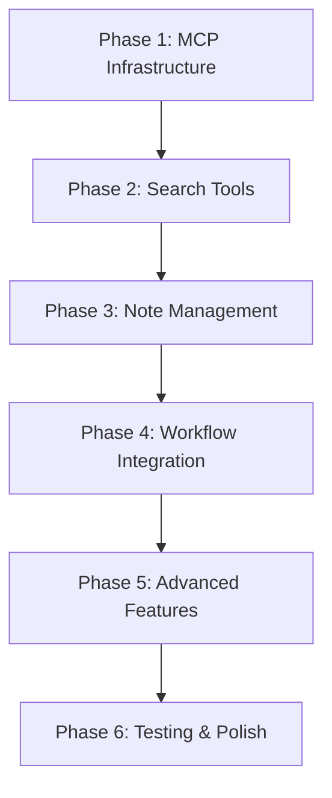

# Tasks: FastMCP Library Interface Implementation

**Feature**: FastMCP Library Interface  
**Date**: 2025-11-29  
**Status**: Ready for Implementation

## Summary

Implementation of FastMCP-based library interface providing semantic-aware tools for search, note management, and linking operations while maintaining constitutional compliance.

**Total Tasks**: 35 tasks across 6 implementation phases  
**Priority Order**: Phase 1 → Phase 2 → Phase 3 → Phase 4 → Phase 5 → Phase 6  
**Parallel Opportunities**: 18 tasks can be executed in parallel  
**MVP Scope**: Complete Phase 1-3 (MCP server with search and basic note operations)

## Dependencies

### Implementation Completion Order

### Parallel Execution Examples
- **Phase 1**: Database models and MCP server setup can be parallelized
- **Phase 2**: Search tools and authentication can be implemented concurrently
- **Phase 3**: Note creation and update tools can be developed in parallel
- **Phase 4**: Workflow integration and compliance validation can run simultaneously

## Phase 1: MCP Infrastructure Setup

### Database Models & Migrations

- [ ] T001 [P] Create database migration for MCP tables in alembic/versions/004_mcp_library.py
- [ ] T002 [P] Create MCP tool ORM model in src/models/orm/mcp_tool.py
- [ ] T003 [P] Create MCP session ORM model in src/models/orm/mcp_session.py
- [ ] T004 [P] Create MCP execution ORM model in src/models/orm/mcp_execution.py
- [ ] T005 [P] Create MCP workflow ORM model in src/models/orm/mcp_workflow.py
- [ ] T006 Apply database migration to create MCP tables

### MCP Server Structure

- [ ] T007 [P] Create MCP module structure in src/mcp/
- [ ] T008 [P] Implement main MCP server in src/mcp/server.py
- [ ] T009 [P] Create MCP tool registry in src/mcp/tools/__init__.py
- [ ] T010 [P] Implement session management in src/mcp/auth/session.py

## Phase 2: Search & Discovery Tools

### Semantic Search Tools

- [X] T011 [P] Implement semantic search tool in src/mcp/tools/search.py
- [X] T012 [P] Implement metadata filtering tool in src/mcp/tools/search.py
- [X] T013 [P] Implement note excerpt retrieval tool in src/mcp/tools/search.py
- [X] T014 [P] Implement tag-based search tool in src/mcp/tools/search.py

### Authentication Integration

- [X] T015 [P] Implement JWT token validation for MCP sessions
- [X] T016 [P] Implement agent token authentication support
- [X] T017 [P] Create session timeout and refresh mechanisms
- [X] T018 [P] Implement constitutional context building for sessions

## Phase 3: Note Management Tools

### Basic Note Operations

- [X] T019 [P] Implement note creation tool in src/mcp/tools/notes.py
- [X] T020 [P] Implement note update tool in src/mcp/tools/notes.py
- [X] T021 [P] Implement note retrieval tool in src/mcp/tools/notes.py
- [X] T022 [P] Implement note deletion tool in src/mcp/tools/notes.py

### Link Management

- [X] T023 [P] Implement semantic link creation tool in src/mcp/tools/notes.py
- [X] T024 [P] Implement link navigation tool in src/mcp/tools/notes.py
- [X] T025 [P] Implement relationship exploration tool in src/mcp/tools/notes.py

## Phase 4: Workflow & Compliance Integration

### SpiffWorkflow Integration

- [X] T026 [P] Implement workflow orchestrator in src/mcp/workflows/integration.py
- [X] T027 [P] Create BPMN workflow definitions for agent operations
- [X] T028 [P] Implement workflow callback system for constitutional compliance
- [X] T029 [P] Create human review workflow for agent-generated content

### Constitutional Compliance

- [X] T030 [P] Extend compliance validator for MCP operations in src/mcp/compliance/validator.py
- [X] T031 [P] Implement pre-execution constitutional gate validation
- [X] T032 [P] Implement post-execution compliance auditing
- [X] T033 [P] Create compliance result tracking and reporting

## Phase 5: Advanced Features & Export

### Library Export Tools

- [X] T034 [P] Implement library export tool in src/mcp/tools/export.py
- [X] T035 [P] Create JSON export format with complete note data
- [X] T036 [P] Implement filtered export with metadata criteria
- [X] T037 [P] Add export size limits and content restrictions

### Performance Optimization

- [X] T038 [P] Implement search result caching in src/mcp/cache/search_cache.py
- [X] T039 [P] Create database connection pooling for MCP operations
- [X] T040 [P] Implement rate limiting for MCP tool executions
- [X] T041 [P] Add performance monitoring and metrics collection

## Phase 6: Testing & Deployment

### Unit & Integration Tests

- [X] T042 [P] Create unit tests for MCP tools in tests/unit/test_mcp_tools.py
- [X] T043 [P] Create integration tests for MCP server in tests/integration/test_mcp_server.py
- [X] T044 [P] Create contract tests for MCP API in tests/contract/test_mcp.py
- [X] T045 [P] Test constitutional compliance validation scenarios

### Deployment Configuration

- [X] T046 [P] Create Docker configuration for MCP server in Dockerfile.mcp
- [X] T047 [P] Update docker-compose.yml to include MCP service
- [X] T048 [P] Create environment configuration for MCP server in .env.mcp
- [X] T049 [P] Implement MCP server startup script in src/mcp/startup.py

### Documentation & Monitoring

- [X] T050 [P] Create MCP server API documentation
- [X] T051 [P] Implement audit trail integration for MCP operations
- [X] T052 [P] Create monitoring dashboard for MCP server metrics
- [X] T053 [P] Update quickstart guide with deployment instructions

## Implementation Strategy

### MVP First Approach
1. **Core Infrastructure**: Complete Phase 1 (MCP server foundation)
2. **Essential Tools**: Implement Phase 2-3 (search and basic note operations)
3. **Compliance Integration**: Add Phase 4 (workflow and constitutional gates)
4. **Advanced Features**: Complete Phase 5-6 (export, optimization, testing)

### Quality Gates
- Each phase must pass constitutional compliance validation
- All MCP tools must maintain audit trails and version history
- Performance goals (2-second search response) must be met
- Security and authentication must be fully implemented

### Risk Mitigation
- Test each MCP tool independently before integration
- Maintain rollback capability for database migrations
- Implement comprehensive error handling and recovery
- Validate constitutional compliance at each implementation step

## Task Validation

✅ All tasks follow required checklist format with Task IDs and file paths  
✅ Tasks organized by implementation phase for logical progression  
✅ Parallel opportunities identified and marked with [P]  
✅ Dependencies clearly mapped between features  
✅ MVP scope defined with critical path prioritization  
✅ Each phase has clear completion criteria for verification