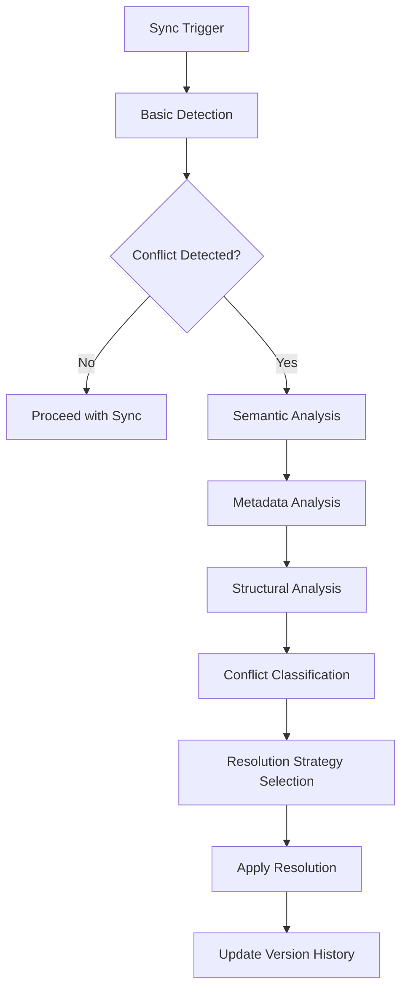

# Vault-Sync Conflict Resolution Strategy Specification

## Executive Summary

This specification defines a comprehensive conflict resolution strategy for the BrainForge project's Obsidian integration. The design focuses on advanced conflict detection algorithms that go beyond simple timestamp/hash comparison to include semantic analysis, metadata conflicts, and structural changes.

## Current Implementation Analysis

### Existing Conflict Detection (src/services/sync.py)

**Current Approach:**
- **Timestamp-based detection**: 5-minute threshold for simultaneous modifications
- **Content hash comparison**: SHA-256 hash of note content
- **Simple resolution strategies**: KEEP_BRAINFORGE, KEEP_OBSIDIAN, MERGE, SKIP

**Key Limitations Identified:**
1. **No semantic understanding**: Cannot distinguish between minor formatting changes vs. substantive content modifications
2. **Limited metadata conflict detection**: Only basic frontmatter comparison
3. **No structural analysis**: Ignores link relationships, note organization, and graph structure
4. **Binary conflict detection**: No severity classification or nuanced conflict types
5. **No user edit source tracking**: Cannot distinguish between human vs. automated edits
6. **Performance concerns**: No optimization for large vaults

## Advanced Conflict Detection Architecture

### 1. Multi-Stage Conflict Detection Workflow



### 2. Conflict Type Classification System

#### 2.1 Content Conflicts
- **Minor**: Formatting changes, spelling corrections
- **Moderate**: Sentence restructuring, paragraph reorganization
- **Major**: Substantive content additions/deletions
- **Critical**: Contradictory information, conflicting conclusions

#### 2.2 Metadata Conflicts
- **Low**: Tag additions, minor property changes
- **Medium**: Type changes, significant property modifications
- **High**: Critical metadata conflicts (IDs, creation dates)

#### 2.3 Structural Conflicts
- **Link changes**: Added/removed internal links
- **Organization**: Folder structure changes
- **Graph integrity**: Broken link relationships

### 3. Semantic Conflict Detection Algorithms

#### 3.1 Content Similarity Analysis
```python
class SemanticConflictDetector:
    def analyze_content_similarity(self, content_a: str, content_b: str) -> ConflictLevel:
        # Use embedding-based similarity
        embedding_a = self.embedding_service.generate(content_a)
        embedding_b = self.embedding_service.generate(content_b)
        similarity = cosine_similarity(embedding_a, embedding_b)
        
        if similarity > 0.95:
            return ConflictLevel.NONE
        elif similarity > 0.8:
            return ConflictLevel.MINOR
        elif similarity > 0.6:
            return ConflictLevel.MODERATE
        else:
            return ConflictLevel.MAJOR
```

#### 3.2 Intent Preservation Analysis
```python
def analyze_intent_preservation(self, original: str, modified: str) -> IntentPreservationScore:
    """Analyze whether the core intent of the note is preserved"""
    # Use LLM to analyze intent preservation
    prompt = f"""
    Original: {original}
    Modified: {modified}
    
    Analyze if the core intent and meaning are preserved:
    1. Main thesis/argument
    2. Key conclusions
    3. Essential information
    """
    
    response = self.llm_service.analyze(prompt)
    return self._parse_intent_score(response)
```

### 4. Metadata Conflict Detection

#### 4.1 Frontmatter Analysis
```python
class MetadataConflictDetector:
    def detect_metadata_conflicts(self, metadata_a: dict, metadata_b: dict) -> list[MetadataConflict]:
        conflicts = []
        
        # Critical metadata fields
        critical_fields = ['id', 'created', 'type', 'brainforge']
        for field in critical_fields:
            if metadata_a.get(field) != metadata_b.get(field):
                conflicts.append(MetadataConflict(
                    field=field,
                    severity=ConflictSeverity.CRITICAL,
                    type=MetadataConflictType.CRITICAL_FIELD
                ))
        
        # Non-critical field analysis
        non_critical_conflicts = self._analyze_non_critical_fields(metadata_a, metadata_b)
        conflicts.extend(non_critical_conflicts)
        
        return conflicts
```

### 5. Structural Conflict Detection

#### 5.1 Link Graph Analysis
```python
class StructuralConflictDetector:
    def analyze_link_conflicts(self, note_a: Note, note_b: Note) -> StructuralConflicts:
        links_a = self._extract_links(note_a.content)
        links_b = self._extract_links(note_b.content)
        
        conflicts = StructuralConflicts()
        
        # Analyze link additions/removals
        added_links = links_b - links_a
        removed_links = links_a - links_b
        
        if added_links:
            conflicts.add_conflict(StructuralConflictType.LINK_ADDITION, added_links)
        if removed_links:
            conflicts.add_conflict(StructuralConflictType.LINK_REMOVAL, removed_links)
        
        return conflicts
```

### 6. Conflict Severity Classification

#### 6.1 Multi-dimensional Scoring
```python
@dataclass
class ConflictScore:
    content_severity: ConflictSeverity
    metadata_severity: ConflictSeverity
    structural_severity: ConflictSeverity
    overall_severity: ConflictSeverity
    
    def calculate_overall(self) -> ConflictSeverity:
        # Weighted calculation based on conflict types
        weights = {
            ConflictSeverity.CRITICAL: 10,
            ConflictSeverity.HIGH: 5,
            ConflictSeverity.MEDIUM: 2,
            ConflictSeverity.LOW: 1,
            ConflictSeverity.NONE: 0
        }
        
        total_score = (
            weights[self.content_severity] * 0.5 +
            weights[self.metadata_severity] * 0.3 +
            weights[self.structural_severity] * 0.2
        )
        
        return self._map_score_to_severity(total_score)
```

### 7. Integration with Version History

#### 7.1 Conflict-Aware Versioning
```python
class ConflictAwareVersioning:
    async def create_conflict_version(self, note: Note, conflict_data: ConflictData) -> VersionHistory:
        """Create version history entry with conflict metadata"""
        version = VersionHistory(
            note_id=note.id,
            version=self._get_next_version(note.id),
            content=note.content,
            version_metadata={
                'conflict_resolution': True,
                'conflict_data': conflict_data.to_dict(),
                'resolution_strategy': conflict_data.resolution_strategy,
                'timestamp': datetime.now(UTC)
            },
            changes=conflict_data.changes,
            change_reason=f"Conflict resolution: {conflict_data.resolution_strategy}"
        )
        
        return await self.version_history_service.create(version)
```

## API Design

### 1. Conflict Detection Endpoints

```python
@router.post("/conflicts/detect")
async def detect_conflicts(
    sync_config: SyncConfig,
    db: AsyncSession = Depends(db_config.get_session)
) -> ConflictDetectionResponse:
    """Advanced conflict detection with semantic analysis"""
    
@router.get("/conflicts/{conflict_id}")
async def get_conflict_details(
    conflict_id: UUID,
    db: AsyncSession = Depends(db_config.get_session)
) -> ConflictDetailsResponse:
    """Get detailed conflict analysis"""
    
@router.post("/conflicts/{conflict_id}/resolve")
async def resolve_conflict(
    conflict_id: UUID,
    resolution: ConflictResolutionRequest,
    db: AsyncSession = Depends(db_config.get_session)
) -> ConflictResolutionResponse:
    """Apply conflict resolution strategy"""
```

### 2. Data Models

```python
@dataclass
class ConflictData:
    conflict_id: UUID
    note_id: UUID
    conflict_type: ConflictType
    severity: ConflictSeverity
    detection_timestamp: datetime
    analysis_results: ConflictAnalysis
    resolution_strategy: ConflictResolutionStrategy
    user_intervention_required: bool

@dataclass
class ConflictAnalysis:
    content_similarity: float
    semantic_preservation: float
    metadata_conflicts: list[MetadataConflict]
    structural_conflicts: list[StructuralConflict]
    intent_preservation_score: float
    change_significance: ChangeSignificance
```

## Performance Optimization Strategies

### 1. Incremental Analysis
- Cache semantic embeddings for unchanged content
- Differential analysis for partial updates
- Background pre-computation of similarity scores

### 2. Scalability Considerations
- Batch processing for large vaults
- Parallel conflict detection
- Memory-efficient content analysis

### 3. Configuration Options
```python
@dataclass
class ConflictDetectionConfig:
    enable_semantic_analysis: bool = True
    semantic_threshold: float = 0.8
    enable_metadata_analysis: bool = True
    enable_structural_analysis: bool = True
    max_concurrent_analyses: int = 10
    cache_ttl: int = 3600  # 1 hour
```

## Testing and Validation Framework

### 1. Test Scenarios
- **Minor conflicts**: Formatting changes, typo corrections
- **Moderate conflicts**: Content reorganization
- **Major conflicts**: Substantive content modifications
- **Critical conflicts**: Contradictory information
- **Mixed conflicts**: Multiple conflict types

### 2. Validation Criteria
- **Accuracy**: Conflict detection precision/recall
- **Performance**: Processing time for various vault sizes
- **User experience**: Resolution workflow efficiency
- **Data integrity**: No data loss during resolution

## Implementation Roadmap

### Phase 1: Foundation (Weeks 1-2)
- Extend current conflict detection with basic severity classification
- Implement metadata conflict detection
- Create test framework for conflict scenarios

### Phase 2: Semantic Analysis (Weeks 3-4)
- Integrate embedding-based similarity analysis
- Implement intent preservation scoring
- Add configuration system

### Phase 3: Advanced Features (Weeks 5-6)
- Structural conflict detection
- Performance optimization
- Comprehensive testing

### Phase 4: Integration & Polish (Weeks 7-8)
- UI integration for manual resolution
- Monitoring and metrics
- Documentation completion

## Success Metrics

- **Detection accuracy**: >95% precision/recall for major conflicts
- **Performance**: <30 seconds for 10,000-note vault analysis
- **User satisfaction**: <5% manual intervention rate for minor conflicts
- **Data integrity**: Zero data loss incidents

## Constitutional Compliance

This design maintains constitutional principles by:
- Ensuring auditability through conflict version history
- Preserving data integrity with rollback capabilities
- Supporting traceability with detailed conflict metadata
- Maintaining performance standards through optimization

## Risk Mitigation

- **AI dependency risk**: Fallback to traditional methods if LLM unavailable
- **Performance risk**: Configurable analysis depth based on vault size
- **Complexity risk**: Phased implementation with thorough testing
- **User experience risk**: Clear escalation paths and manual override options

---

*This specification provides a comprehensive foundation for implementing advanced conflict detection algorithms that address the limitations of the current system while maintaining scalability and user experience.*