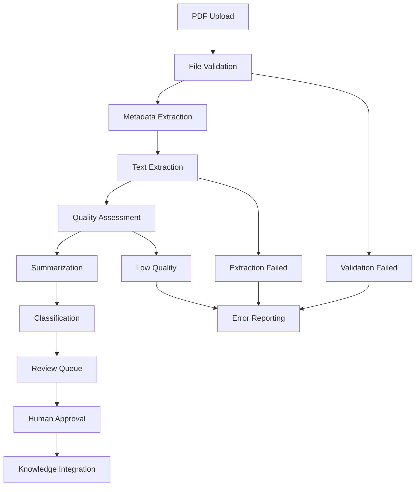

# Data Model: PDF Processing for Ingestion Curation

**Feature**: Add PDF processing capability to ingestion pipeline  
**Date**: 2025-11-29  
**Branch**: 002-ingestion-curation

## Overview

Extend existing ingestion data models to support PDF document processing with dockling integration. Maintain backward compatibility while adding PDF-specific metadata and processing capabilities.

## Entity Definitions

### 1. PDFMetadata (NEW)
Extends the existing ingestion system with PDF-specific metadata.

**Fields**:
- `id` (UUID, Primary Key): Unique identifier
- `ingestion_task_id` (UUID, Foreign Key): Reference to parent IngestionTask
- `page_count` (Integer): Number of pages in PDF
- `author` (String, Optional): Document author from metadata
- `title` (String, Optional): Document title from metadata
- `subject` (String, Optional): Document subject from metadata
- `creation_date` (DateTime, Optional): PDF creation date
- `modification_date` (DateTime, Optional): PDF modification date
- `pdf_version` (String): PDF version (e.g., "1.4", "1.7")
- `encryption_status` (String): Encryption status ("none", "password", "certificate")
- `extraction_method` (String): Text extraction method used ("dockling_basic", "dockling_advanced")
- `extraction_quality_score` (Float): Quality score of text extraction (0.0-1.0)
- `created_at` (DateTime): Record creation timestamp
- `updated_at` (DateTime): Record update timestamp

**Relationships**:
- One-to-one with `IngestionTask` (extends existing model)

### 2. IngestionTask (EXTENDED)
Extend existing model to support PDF processing.

**New Fields**:
- `content_type` (String): Extended to include "pdf" value
- `file_size` (Integer): File size in bytes (for PDF validation)
- `processing_attempts` (Integer): Number of processing attempts
- `last_processing_error` (String, Optional): Last error message if processing failed

**Validation Rules**:
- PDF files must be ≤ 100MB
- Content type must be one of: ["web", "video", "text", "pdf"]
- Processing attempts must be ≤ 3 before marking as failed

### 3. PDFProcessingResult (NEW)
Store detailed PDF processing results.

**Fields**:
- `id` (UUID, Primary Key): Unique identifier
- `ingestion_task_id` (UUID, Foreign Key): Reference to parent task
- `extracted_text` (Text): Full text extracted from PDF
- `text_quality_metrics` (JSON): Quality metrics (character count, word count, extraction confidence)
- `section_breaks` (JSON): Document structure (page breaks, section headers)
- `processing_time_ms` (Integer): Processing time in milliseconds
- `dockling_version` (String): Version of dockling used
- `created_at` (DateTime): Record creation timestamp

**Relationships**:
- One-to-one with `IngestionTask`

## State Transitions

### PDF Ingestion Workflow

### Processing States

1. **VALIDATING**: Initial file validation and security checks
2. **EXTRACTING_METADATA**: Extracting PDF metadata using dockling
3. **EXTRACTING_TEXT**: Performing text extraction
4. **ASSESSING_QUALITY**: Evaluating extraction quality
5. **SUMMARIZING**: Generating content summary
6. **CLASSIFYING**: Applying tags and classifications
7. **AWAITING_REVIEW**: Waiting for human approval
8. **INTEGRATED**: Successfully integrated into knowledge base
9. **FAILED**: Processing failed with error details

## Validation Rules

### PDF-Specific Validations

1. **File Size**: ≤ 100MB
2. **Content Type**: Must be valid PDF (MIME type validation)
3. **Encryption**: Password-protected PDFs require user intervention
4. **Structure**: Must contain extractable text content
5. **Metadata**: Required fields must be present for processing

### Business Rules

1. **Retry Logic**: Maximum 3 processing attempts per PDF
2. **Quality Threshold**: Extraction quality score ≥ 0.7 for automatic processing
3. **Review Required**: Low-quality extractions (score < 0.7) require manual review
4. **Duplicate Detection**: Check for duplicate PDF content based on text similarity
5. **Version Control**: Maintain processing version for audit purposes

## Integration Points

### With Existing Models

- **Note**: PDF content becomes literature notes after approval
- **Embedding**: PDF text gets embedded for semantic search
- **Link**: Connections to existing knowledge based on content similarity
- **VersionHistory**: Track PDF processing and approval history

### External Dependencies

- **dockling**: PDF text extraction and metadata collection
- **AI Services**: Summarization and classification
- **Storage**: File storage for original PDFs (temporary)
- **Audit System**: Log all PDF processing activities

## Migration Strategy

1. **Backward Compatibility**: Existing ingestion workflows unchanged
2. **Gradual Rollout**: PDF processing as optional enhancement
3. **Data Migration**: No migration required for existing data
4. **Testing**: Comprehensive testing before production deployment

## Performance Considerations

- **Indexing**: Add indexes on `ingestion_task_id` and `content_type`
- **Partitioning**: Consider partitioning by date for large volumes
- **Caching**: Cache extraction results for repeated processing
- **Batch Processing**: Support batch PDF ingestion for efficiency