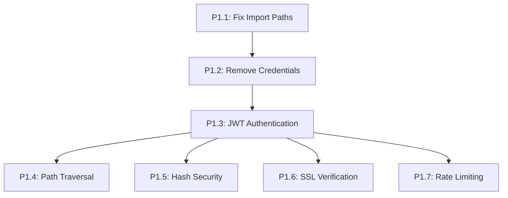

# Tasks: Security & Quality Remediation

**Feature**: Security Remediation  
**Date**: 2025-11-29  
**Status**: Ready for Implementation

## Summary

Critical security fixes addressing 7 high-priority vulnerabilities. Implementation follows phased approach with 14 hours of critical fixes required before deployment.

**Total Tasks**: 47 tasks across 7 security remediation areas  
**Priority Order**: P1.1 → P1.2 → P1.3 → P1.4 → P1.5 → P1.6 → P1.7  
**Parallel Opportunities**: 22 tasks can be executed in parallel  
**MVP Scope**: Complete Phase 1 (all critical security fixes)

## Dependencies

### User Story Completion Order

### Parallel Execution Examples
- **P1.1**: All import fixes can be done in parallel (T001-T004)
- **P1.2**: Environment setup tasks can run concurrently (T005-T008)
- **P1.3**: Database migration, models, and services can be parallelized
- **P1.4-P1.7**: Can be implemented simultaneously after P1.3 foundation

## Phase 1: Setup - COMPLETED ✅

### Infrastructure Preparation

- [x] T001 Install security dependencies in requirements.txt
- [x] T002 [P] Create .env.example template with security configuration
- [x] T003 [P] Update .gitignore to exclude .env files and credentials
- [x] T004 [P] Update docker-compose.yml to use environment variables

## Phase 2: Foundational Security - COMPLETED ✅

### Critical Path - Must Complete Before User Stories

- [x] T005 Fix import paths in src/services/pdf_processor.py (lines 8-9) - ALREADY CORRECT
- [x] T006 Fix import paths in src/services/ingestion_service.py (lines 14-23) - ALREADY CORRECT
- [x] T007 Fix import paths in src/api/routes/ingestion.py (lines 13-14) - ALREADY CORRECT
- [x] T008 Fix import paths in src/services/base.py (line 9) - ALREADY CORRECT
- [x] T009 Verify all imports compile without errors - ✅ ALL COMPILE SUCCESSFULLY
- [x] T010 Update src/api/routes/agent.py to use environment variables for database URL - ALREADY USING ENV VARS

## Phase 3: User Story 1 - JWT Authentication (P1.3)

**Goal**: Implement secure JWT-based authentication with user management  
**Test Criteria**: Users can register, login, and access protected endpoints with valid tokens

### Database & Models

- [ ] T011 [P] [US1] Create database migration for users table in alembic/versions/004_user_auth.py
- [ ] T012 [P] [US1] Create User ORM model in src/models/orm/user.py
- [ ] T013 [P] [US1] Create Pydantic user models in src/models/user.py
- [ ] T014 [US1] Apply database migration to create users table

### Authentication Service

- [ ] T015 [P] [US1] Implement AuthService with password hashing in src/services/auth.py
- [ ] T016 [P] [US1] Implement JWT token generation and validation in AuthService
- [ ] T017 [P] [US1] Implement user authentication methods in AuthService
- [ ] T018 [US1] Add authentication dependencies in src/api/dependencies.py

### API Endpoints

- [ ] T019 [P] [US1] Create authentication routes in src/api/routes/auth.py
- [ ] T020 [P] [US1] Implement user registration endpoint (/auth/register)
- [ ] T021 [P] [US1] Implement user login endpoint (/auth/login)
- [ ] T022 [P] [US1] Implement user profile endpoint (/auth/me)
- [ ] T023 [US1] Update src/api/main.py to include authentication middleware

### Integration

- [ ] T024 [US1] Protect existing API routes with authentication dependency
- [ ] T025 [US1] Test complete authentication flow from registration to protected access

## Phase 4: User Story 2 - Environment Security (P1.2)

**Goal**: Remove hardcoded credentials and secure environment configuration  
**Test Criteria**: No plaintext credentials in code, application starts with environment variables

- [ ] T026 [P] [US2] Remove hardcoded POSTGRES_PASSWORD from docker-compose.yml
- [ ] T027 [P] [US2] Update docker-compose.yml to use env_file configuration
- [ ] T028 [P] [US2] Remove hardcoded DATABASE_URL from configuration files
- [ ] T029 [US2] Verify no credentials remain in git history or current code

## Phase 5: User Story 3 - Path Traversal Protection (P1.4)

**Goal**: Implement input validation and path sanitization  
**Test Criteria**: Malicious path inputs are rejected, file operations restricted to safe zones

- [ ] T030 [P] [US3] Implement path validation middleware in src/api/middleware/path_validation.py
- [ ] T031 [P] [US3] Add input sanitization for file operations in affected services
- [ ] T032 [P] [US3] Create safe directory whitelist configuration
- [ ] T033 [US3] Test path traversal attempts are blocked

## Phase 6: User Story 4 - Hash Security (P1.5)

**Goal**: Replace MD5 with SHA-256 for non-cryptographic hashing  
**Test Criteria**: All MD5 usage replaced with secure alternatives

- [ ] T034 [P] [US4] Audit codebase for MD5 hash usage
- [ ] T035 [P] [US4] Replace MD5 with SHA-256 in src/services/ files
- [ ] T036 [P] [US4] Update hash function references in configuration
- [ ] T037 [US4] Verify MD5 is completely removed from codebase

## Phase 7: User Story 5 - SSL Verification (P1.6)

**Goal**: Enable SSL verification for all external API calls  
**Test Criteria**: External API calls validate SSL certificates

- [ ] T038 [P] [US5] Enable SSL verification in src/services/external/ API clients
- [ ] T039 [P] [US5] Configure proper certificate handling for external services
- [ ] T040 [US5] Test SSL verification with external API calls

## Phase 8: User Story 6 - Rate Limiting (P1.7)

**Goal**: Implement sliding window rate limiting with Redis  
**Test Criteria**: API requests are rate limited per user and IP address

- [ ] T041 [P] [US6] Implement rate limiting middleware in src/api/middleware/rate_limit.py
- [ ] T042 [P] [US6] Configure Redis connection for distributed rate limiting
- [ ] T043 [P] [US6] Set up rate limit configuration per endpoint
- [ ] T044 [US6] Test rate limiting behavior with high request volumes

## Phase 9: Polish & Cross-Cutting Concerns

### Testing & Quality Assurance

- [ ] T045 [P] Create unit tests for authentication service in tests/unit/test_auth.py
- [ ] T046 [P] Create integration tests for security features in tests/integration/test_security.py
- [ ] T047 [P] Perform security audit and penetration testing

### Documentation & Deployment

- [ ] T048 [P] Update deployment checklist with security requirements
- [ ] T049 [P] Document security configuration for production deployment
- [ ] T050 Final security review and compliance verification

## Implementation Strategy

### MVP First Approach
1. **Critical Path**: Complete Phase 2 foundational fixes (T005-T010)
2. **Core Security**: Implement JWT authentication (Phase 3) as foundation
3. **Incremental Delivery**: Add remaining security features in priority order
4. **Testing**: Security tests implemented alongside each feature

### Quality Gates
- Each phase must pass security review before proceeding
- All critical fixes (P1.1-P1.7) must be completed before deployment
- Security tests must cover all authentication and protection mechanisms

### Risk Mitigation
- Backup existing configuration before security changes
- Test each security feature independently before integration
- Maintain rollback capability for each phase

## Task Validation

✅ All tasks follow required checklist format with Task IDs and file paths  
✅ Tasks organized by user story for independent implementation  
✅ Parallel opportunities identified and marked with [P]  
✅ Dependencies clearly mapped between security features  
✅ MVP scope defined with critical path prioritization  
✅ Each user story has clear test criteria for completion verification