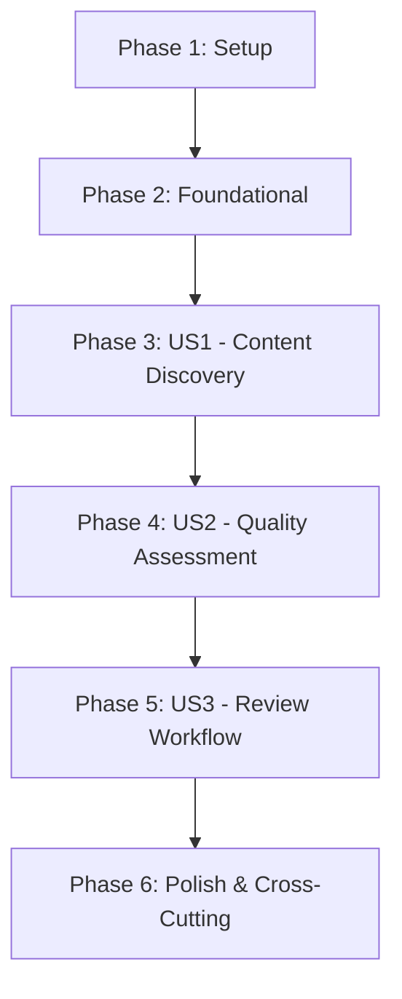

# Implementation Tasks: Researcher Agent

**Feature**: 003-researcher-agent  
**Date**: 2025-11-29  
**Total Tasks**: 42  
**MVP Scope**: User Story 1 (Automated Content Discovery)

## Dependencies & Story Completion Order

**Parallel Execution Opportunities**:
- Database migrations can run parallel to service implementations
- External API integrations can be developed independently
- Model implementations can proceed in parallel within each phase
- Contract tests can be written concurrently with implementation

## Phase 1: Setup

### Project Initialization

- [x] T001 Create researcher agent database migration in alembic/versions/003_researcher_agent.py
- [x] T002 Add researcher agent dependencies to requirements.txt (PydanticAI, FastMCP, SpiffWorkflow)
- [x] T003 Create researcher agent configuration in config/researcher_agent.env
- [x] T004 Set up external API configuration templates in config/api_keys.env.template

## Phase 2: Foundational

### Blocking Prerequisites

- [x] T005 [P] Implement ResearchRun model in src/models/research_run.py
- [x] T006 [P] Implement ContentSource model in src/models/content_source.py
- [x] T007 [P] Implement QualityAssessment model in src/models/quality_assessment.py
- [x] T008 [P] Implement ReviewQueue model in src/models/review_queue.py
- [x] T009 [P] Implement IntegrationProposal model in src/models/integration_proposal.py
- [x] T010 [P] Implement ResearchAuditTrail model in src/models/research_audit_trail.py
- [x] T011 Create database migration for researcher agent tables in alembic/versions/003_researcher_agent.py

## Phase 3: User Story 1 - Automated Content Discovery (P1)

**Goal**: Enable automated discovery of external content based on research topics  
**Independent Test**: Initiate research runs with different topics and verify relevant source discovery

### Models & Services

- [x] T012 [US1] Implement ResearchRunService in src/services/research_run_service.py
- [x] T013 [US1] Implement ContentDiscoveryService in src/services/content_discovery_service.py
- [x] T014 [US1] Implement GoogleCustomSearch integration in src/services/external/google_search.py
- [x] T015 [US1] Implement SemanticScholar integration in src/services/external/semantic_scholar.py
- [x] T016 [US1] Implement NewsAPI integration in src/services/external/news_api.py

### API Endpoints

- [x] T017 [US1] Create research runs endpoint in src/api/routes/research.py
- [x] T018 [US1] Implement research run creation API in src/api/routes/research.py
- [x] T019 [US1] Implement research run status API in src/api/routes/research.py
- [x] T020 [US1] Implement content sources listing API in src/api/routes/research.py

### Integration & Testing

- [x] T021 [US1] Create contract tests for research endpoints in tests/contract/test_research.py
- [x] T022 [US1] Implement research run orchestration in src/services/research_orchestrator.py

## Phase 4: User Story 2 - Content Evaluation and Quality Assessment (P2)

**Goal**: Automated quality assessment of discovered content  
**Independent Test**: Provide mixed-quality sources and verify correct scoring

### Quality Assessment

- [x] T023 [US2] Implement QualityAssessmentService in src/services/quality_assessment_service.py
- [x] T024 [US2] Implement credibility scoring logic in src/services/scoring/credibility_scorer.py
- [x] T025 [US2] Implement relevance scoring logic in src/services/scoring/relevance_scorer.py
- [x] T026 [US2] Implement freshness scoring logic in src/services/scoring/freshness_scorer.py
- [x] T027 [US2] Implement completeness scoring logic in src/services/scoring/completeness_scorer.py
- [x] T028 [US2] Implement weighted overall scoring in src/services/quality_assessment_service.py

### AI Integration

- [x] T029 [US2] Implement PydanticAI integration for content summarization in src/services/ai/summarizer.py
- [x] T030 [US2] Implement content classification AI in src/services/ai/classifier.py
- [x] T031 [US2] Implement quality assessment rationale generation in src/services/ai/quality_rationale.py

### API & Testing

- [x] T032 [US2] Implement quality assessment API in src/api/routes/quality.py
- [x] T033 [US2] Create contract tests for quality assessment in tests/contract/test_quality.py

## Phase 5: User Story 3 - Human Review and Integration Workflow (P3)

**Goal**: Streamlined human review process for agent recommendations  
**Independent Test**: Create review queue and verify effective evaluation process

### Review Workflow

- [ ] T034 [US3] Implement ReviewQueueService in src/services/review_queue_service.py
- [ ] T035 [US3] Implement review assignment logic in src/services/review_queue_service.py
- [ ] T036 [US3] Implement review decision processing in src/services/review_processor.py
- [ ] T037 [US3] Implement integration proposal generation in src/services/integration_proposal_service.py

### Integration & Semantic Analysis

- [ ] T038 [US3] Implement semantic similarity analysis for integration in src/services/integration/semantic_analyzer.py
- [ ] T039 [US3] Implement connection suggestion logic in src/services/integration/connection_suggester.py
- [ ] T040 [US3] Implement tag suggestion logic in src/services/integration/tag_suggester.py

### API & Testing

- [ ] T041 [US3] Implement review queue API in src/api/routes/review.py
- [ ] T042 [US3] Implement integration proposals API in src/api/routes/integration.py
- [ ] T043 [US3] Create contract tests for review workflow in tests/contract/test_review.py

## Phase 6: Polish & Cross-Cutting Concerns

### Error Handling & Resilience

- [ ] T044 Implement retry logic for external APIs in src/services/external/base_api_client.py
- [ ] T045 Implement circuit breaker pattern in src/services/external/circuit_breaker.py
- [ ] T046 Implement research failure handling in src/services/research_orchestrator.py

### Audit & Monitoring

- [ ] T047 Implement comprehensive audit trail logging in src/services/audit/research_audit.py
- [ ] T048 Implement performance metrics collection in src/services/metrics/research_metrics.py
- [ ] T049 Implement activity reporting in src/services/reporting/research_reporter.py

### Configuration & Optimization

- [ ] T050 Implement configurable quality thresholds in config/researcher_agent.yaml
- [ ] T051 Implement parallel processing for content discovery in src/services/content_discovery_service.py
- [ ] T052 Implement content deduplication logic in src/services/deduplication/content_deduplicator.py

## Implementation Strategy

### MVP First Approach
**Phase 3 (US1) delivers core functionality**: Automated content discovery with basic quality assessment
- Research runs can be initiated and monitored
- Content is discovered from external sources
- Basic quality scoring is applied
- Human review interface is available

### Incremental Delivery
1. **MVP**: US1 complete - basic research functionality
2. **Enhanced**: US2 complete - sophisticated quality assessment
3. **Full**: US3 complete - complete review and integration workflow
4. **Polished**: Cross-cutting concerns addressed

### Testing Strategy
- Contract tests for all API endpoints
- Integration tests for research workflows
- Unit tests for scoring algorithms and AI integrations
- Performance tests for research run completion times

## Success Criteria Validation

Each user story phase includes validation against success criteria:
- **US1**: Research runs complete within 30 minutes, relevant content discovered for 80% of topics
- **US2**: Quality assessment achieves 90% accuracy compared to human evaluation
- **US3**: Reviewers can process 15+ items per hour with complete audit trails

## Parallel Execution Examples

**Within US1 Phase**:
- T012-T016 (services) can run in parallel
- T017-T020 (API endpoints) can run after service implementations
- T021 (contract tests) can be written concurrently

**Cross-Phase Opportunities**:
- Database models (T005-T011) can be implemented while planning service layers
- External API integrations can be developed independently of core business logic
- AI integration components can be built in parallel with data processing logic

This task breakdown enables efficient parallel development while maintaining clear dependencies and ensuring each phase delivers independently testable functionality.