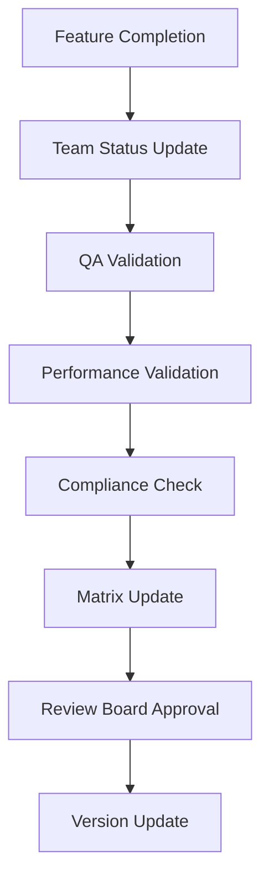

# BrainForge Traceability Matrix Maintenance Guide

**Created**: 2025-11-30  
**Version**: 1.0.0  
**Status**: Active  
**Purpose**: Guidelines for maintaining and updating the traceability matrix

## 1. Maintenance Framework Overview

This guide provides a structured approach for keeping the BrainForge traceability matrix current and accurate throughout the development lifecycle.

## 2. Maintenance Responsibilities

### 2.1 Role Definitions

| Role | Responsibilities | Update Frequency |
|------|-----------------|------------------|
| **Technical Review Board** | Overall matrix validation and approval | Bi-weekly |
| **Feature Teams** | Status updates for assigned features | Upon feature completion |
| **QA Team** | Test coverage validation and reporting | Weekly |
| **Performance Team** | Performance benchmark validation | Monthly |
| **Documentation Team** | Matrix formatting and consistency | Bi-weekly |

### 2.2 Update Triggers

**Mandatory Updates** (must trigger matrix review):
- Feature completion and deployment
- Major architectural changes
- Test coverage milestones reached
- Performance benchmarks achieved
- Constitutional compliance changes

**Recommended Updates**:
- Bi-weekly during active development
- Monthly during maintenance phases
- Before major releases

## 3. Update Process

### 3.1 Status Update Workflow



### 3.2 Status Validation Criteria

#### ✅ Complete Status
- **Implementation**: Feature fully functional with all requirements met
- **Testing**: Comprehensive test coverage (>90% for critical components)
- **Documentation**: Complete API and user documentation
- **Performance**: Meets constitutional performance requirements
- **Compliance**: Full constitutional compliance verified

#### 🔄 Partial Status
- **Implementation**: Core functionality exists but missing advanced features
- **Testing**: Basic tests exist but coverage incomplete
- **Documentation**: Partial documentation available
- **Performance**: Basic performance but not fully optimized
- **Compliance**: Partial compliance with known gaps

#### ❌ Not Started Status
- **Implementation**: No implementation work begun
- **Testing**: No tests exist
- **Documentation**: No documentation available
- **Performance**: No performance data
- **Compliance**: Compliance status unknown

### 3.3 Update Checklist

**Before Matrix Update**:
- [ ] Verify feature implementation completeness
- [ ] Confirm test coverage meets targets
- [ ] Validate performance benchmarks
- [ ] Check constitutional compliance
- [ ] Review documentation completeness
- [ ] Obtain team sign-off

**During Matrix Update**:
- [ ] Update requirement status with accurate notes
- [ ] Update test coverage percentages
- [ ] Add implementation notes and references
- [ ] Update timeline estimates if needed
- [ ] Increment version number
- [ ] Update "Last Updated" date

**After Matrix Update**:
- [ ] Notify relevant teams of changes
- [ ] Update project documentation references
- [ ] Archive previous version
- [ ] Schedule next review cycle

## 4. Quality Assurance Process

### 4.1 Validation Steps

1. **Implementation Verification**
   - Code review completion
   - Feature functionality testing
   - Integration testing results

2. **Test Coverage Validation**
   - Unit test coverage reports
   - Integration test results
   - Performance test benchmarks

3. **Compliance Verification**
   - Constitutional compliance check
   - Security review completion
   - Performance requirement validation

4. **Documentation Review**
   - API documentation completeness
   - User guide accuracy
   - Technical specification alignment

### 4.2 Quality Metrics

| Metric | Target | Measurement Frequency |
|--------|--------|----------------------|
| Requirement Coverage | 100% | Bi-weekly |
| Test Coverage | >90% critical components | Weekly |
| Performance Compliance | 100% constitutional requirements | Monthly |
| Documentation Coverage | 100% features documented | Bi-weekly |
| Compliance Adherence | 100% constitutional principles | Monthly |

## 5. Change Management

### 5.1 Version Control

**Matrix Versioning**:
- **Major version**: Architectural changes or major feature additions
- **Minor version**: Feature completion or significant updates
- **Patch version**: Corrections or minor updates

**Change Log Requirements**:
- Document all status changes with reasons
- Track implementation progress over time
- Maintain historical accuracy for audit purposes

### 5.2 Approval Workflow

**Standard Updates** (minor changes):
1. Feature team submits status update
2. QA team validates test coverage
3. Documentation team updates matrix
4. Technical review board approves

**Major Updates** (architectural changes):
1. Architecture review committee approval
2. Security and compliance review
3. Performance impact assessment
4. Technical review board final approval

## 6. Integration with Development Process

### 6.1 Agile Development Integration

**Sprint Planning**:
- Review matrix status during sprint planning
- Identify gaps for upcoming sprints
- Set implementation priorities based on matrix gaps

**Sprint Review**:
- Update matrix with completed features
- Validate test coverage for new features
- Update performance benchmarks

**Retrospective**:
- Review matrix accuracy and usefulness
- Identify process improvements
- Update maintenance procedures if needed

### 6.2 Continuous Integration Integration

**Automated Validation**:
- Test coverage percentage validation
- Performance benchmark checking
- Compliance rule verification

**Reporting Integration**:
- Automated status reporting
- Gap analysis generation
- Progress tracking dashboards

## 7. Tools and Templates

### 7.1 Update Templates

**Feature Completion Template**:
```markdown
## Feature: [Feature Name]
**Completion Date**: [Date]
**Implementation**: [File paths and components]
**Test Coverage**: [Percentage and test files]
**Performance**: [Benchmarks achieved]
**Compliance**: [Constitutional principles met]
**Notes**: [Additional information]
```

**Status Update Template**:
```markdown
| Requirement ID | Previous Status | New Status | Change Reason | Test Coverage | Notes |
|---------------|----------------|------------|---------------|---------------|-------|
| FR-XXX | Partial | Complete | Implementation completed | 95% | [Details] |
```

### 7.2 Reporting Templates

**Bi-weekly Status Report**:
```markdown
# Traceability Matrix Status Report
**Period**: [Start Date] - [End Date]
**Overall Coverage**: [Percentage]
**Key Updates**: [List of major changes]
**Critical Gaps**: [Remaining high-priority gaps]
**Next Review**: [Next review date]
```

## 8. Troubleshooting and Common Issues

### 8.1 Common Problems

**Status Drift**:
- **Symptom**: Matrix status doesn't match actual implementation
- **Solution**: Implement regular validation checks and team accountability

**Incomplete Testing**:
- **Symptom**: Features marked complete but test coverage low
- **Solution**: Require test coverage validation before status update

**Performance Gaps**:
- **Symptom**: Functional implementation but performance targets not met
- **Solution**: Separate functional and performance status tracking

### 8.2 Escalation Procedures

**Minor Issues**:
- Resolution by feature teams with documentation team support
- Update during next regular review cycle

**Major Issues**:
- Escalation to technical review board
- Immediate matrix update required
- Formal review and approval process

## 9. Success Metrics and KPIs

### 9.1 Matrix Quality Metrics

| KPI | Target | Measurement |
|-----|--------|-------------|
| Accuracy Rate | >95% | Random validation checks |
| Update Timeliness | <2 business days | Time from feature completion to update |
| Completeness | 100% | All requirements tracked |
| Consistency | >90% | Cross-references accurate |

### 9.2 Development Impact Metrics

| KPI | Target | Measurement |
|-----|--------|-------------|
| Requirement Coverage | 100% | Percentage of specs implemented |
| Test Coverage | >90% | Critical component coverage |
| Performance Compliance | 100% | Constitutional requirements met |
| Compliance Adherence | 100% | Constitutional principles followed |

## 10. Continuous Improvement

### 10.1 Feedback Mechanisms

**Team Feedback**:
- Regular surveys on matrix usefulness
- Suggestion collection during retrospectives
- Process improvement recommendations

**Usage Analytics**:
- Matrix access and update frequency
- Most referenced sections
- Common search patterns

### 10.2 Improvement Cycle

1. **Collect Feedback**: Gather team input and usage data
2. **Analyze Effectiveness**: Identify areas for improvement
3. **Implement Changes**: Update processes and templates
4. **Measure Impact**: Track improvement effectiveness
5. **Iterate**: Continuous refinement cycle

## 11. Conclusion

This maintenance framework ensures the BrainForge traceability matrix remains an accurate and valuable tool throughout the development lifecycle. By following these guidelines, the project can maintain clear requirement → implementation → test alignment and prevent specification drift.

The key to success is regular validation, clear responsibilities, and integration with existing development processes.

---

**Next Framework Review**: 2025-12-31  
**Framework Owner**: Technical Review Board  
**Contact**: [Technical Review Board Email/Channel]